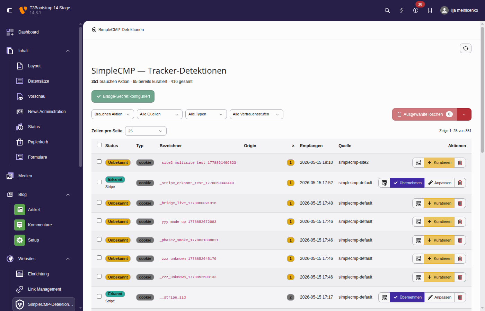
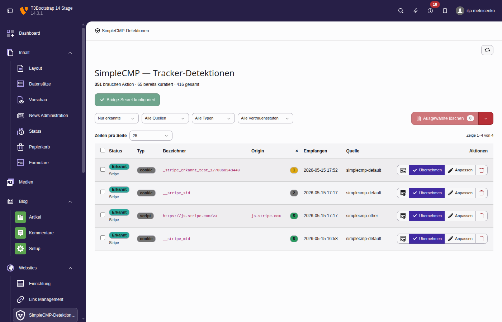
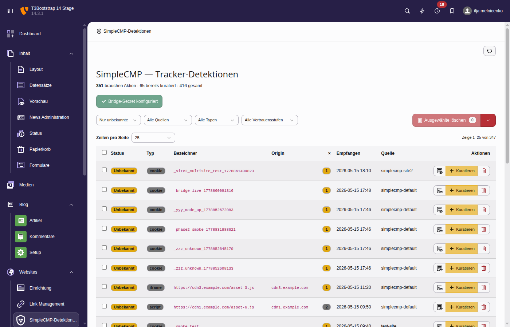
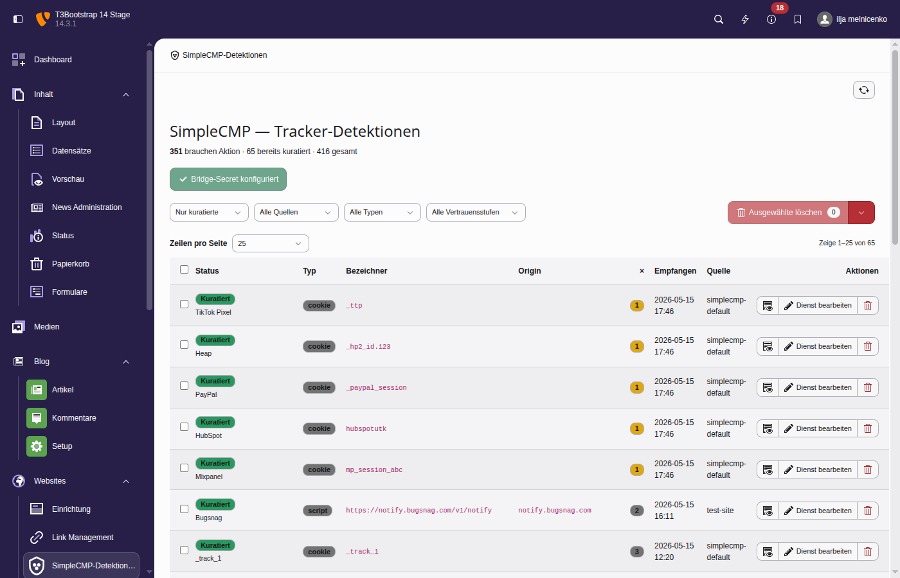
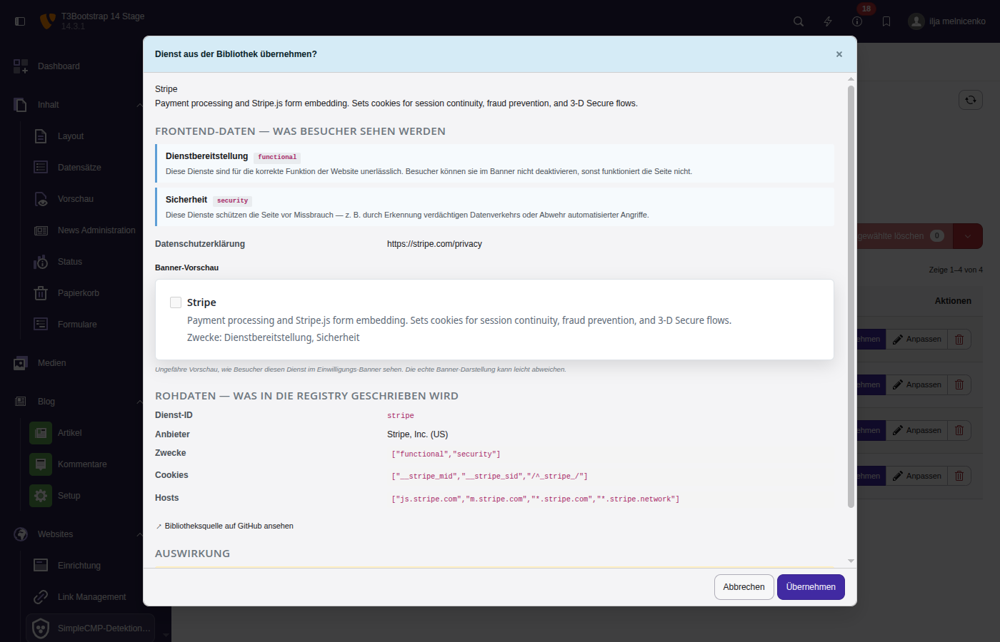
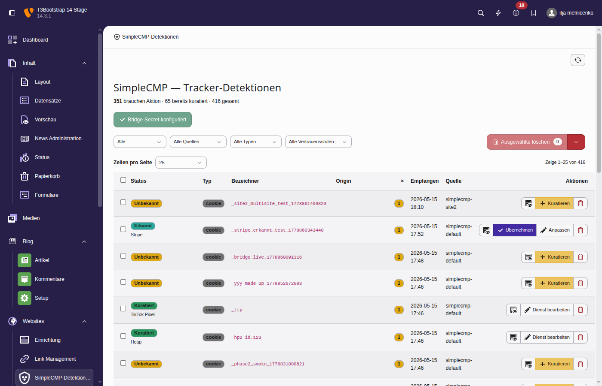
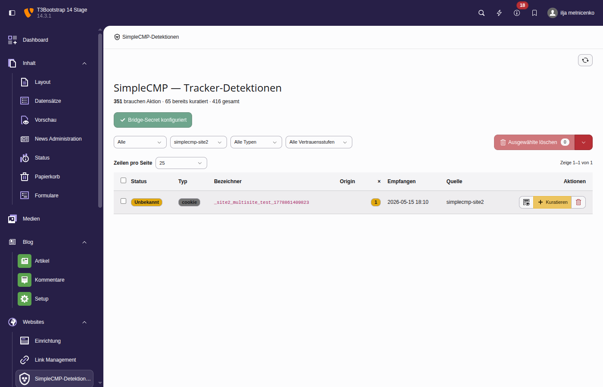
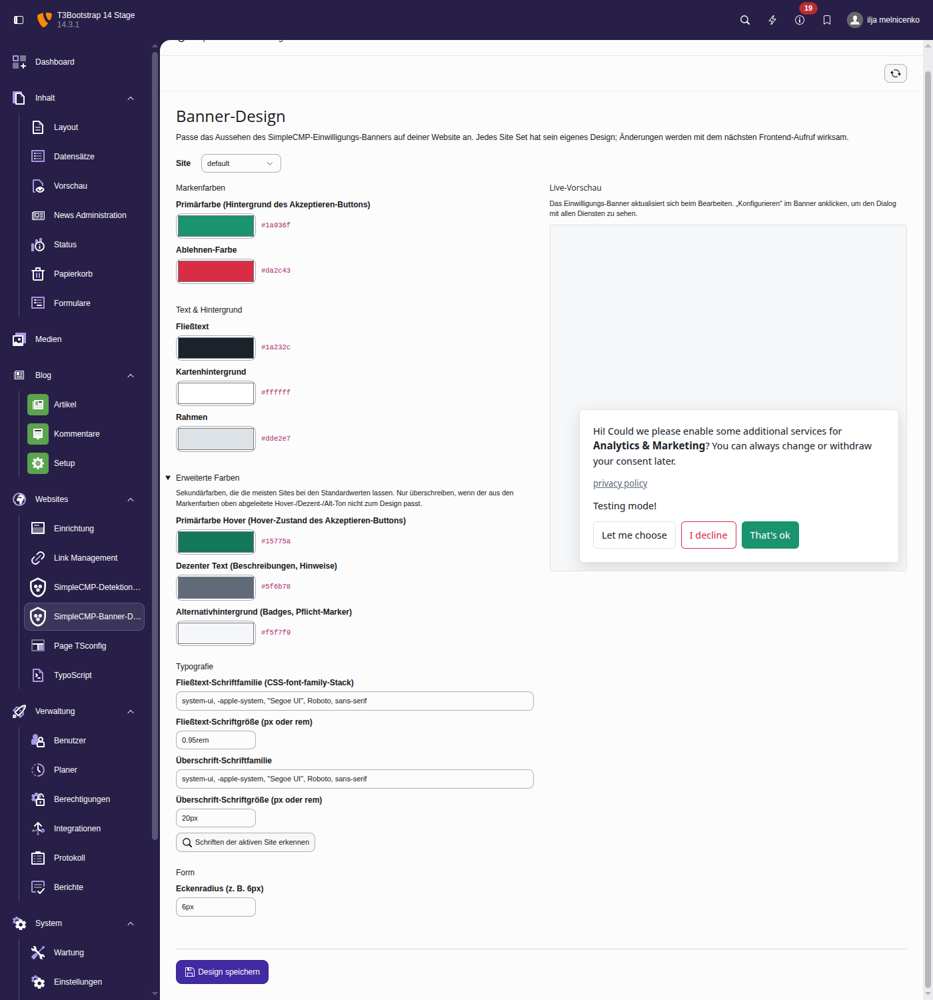
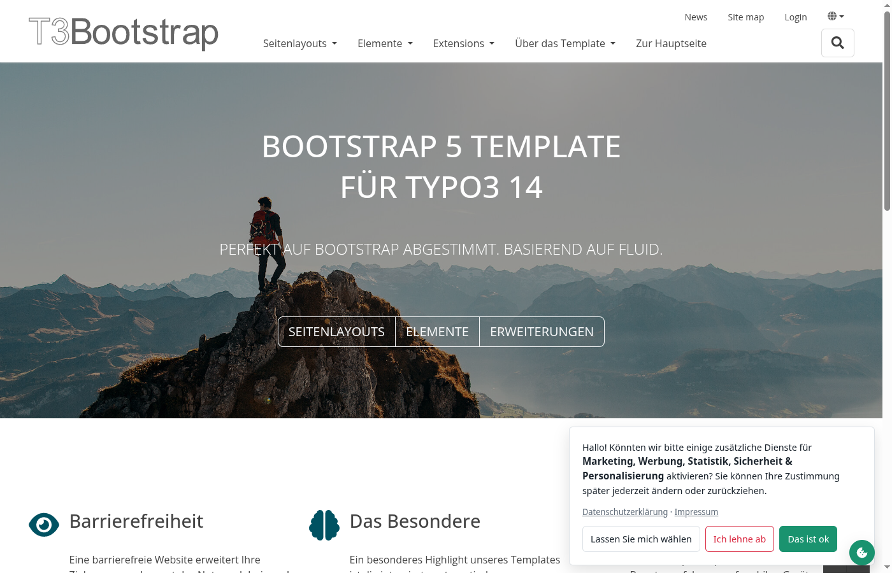
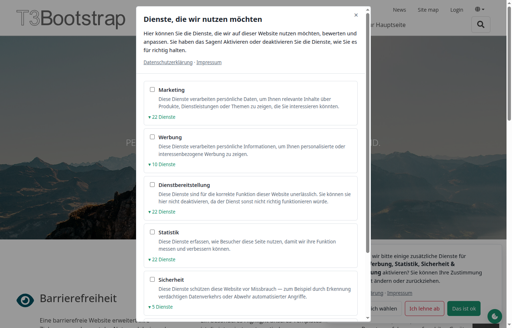

# SimpleCMP for TYPO3

TYPO3 v14 integration for [SimpleCMP](https://github.com/SimpleCMP/simplecmp) — the
open-source consent manager with development-time tracker auto-detection, a shared
service database, and optional CMS-bridge webhook alerts.

This extension is **pre-1.0** and tracks SimpleCMP's own pre-release status. APIs
will change.



*The detection triage view, default filter. The four-state model
(curated / recognised / unknown / dismissed) surfaces what the admin
should actually do next; dismissed rows are filed under the Verworfen
filter and excluded from this default actionable view.*

## What it does

- **Frontend integration** — embeds the SimpleCMP JS bundle on every TYPO3
  frontend page, sourcing its `init({...})` config from the active Site
  Set's settings. The service registry (`tx_simplecmptypo3_service`)
  drives the runtime services array and a per-language `translations`
  block.

- **Service-DB endpoint** at `/api/simplecmp/v1/{health,services,lookup}` —
  implements the upstream
  [Service-DB protocol](https://github.com/SimpleCMP/simplecmp/blob/main/docs/service-db-protocol.md).
  Classifier coverage comes from two sources unioned at lookup time:
  the admin-curated registry (`tx_simplecmptypo3_service`) plus the
  bundled [`simplecmp/services-library`](https://github.com/SimpleCMP/services-library)
  composer package (Hotjar, Stripe, Intercom, TikTok Pixel, hCaptcha,
  Mailchimp, and hundreds more — read-only reference, no DB mirror).
  Admin adopts a library entry into the registry via the BE *Bibliothek*
  tab or by Übernehmen on a real detection; only adopted entries appear
  on the visitor's banner.

- **CMS-bridge receiver** at `/api/simplecmp/webhook` — accepts the
  HMAC-signed POSTs the frontend bridge emits when the recorder catches a
  cookie or origin neither the local classifier nor the Service-DB
  endpoint recognises. Idempotent: repeat hits of the same
  `(source, kind, identifier)` triple bump `occurrences` instead of
  inserting duplicates.

- **BE detection module** at *Websites → SimpleCMP* — three tabs and a
  four-state model. Tabs:

  - *Detektionen* — observation log of trackers visitors triggered.
  - *Dienste* — full registry index, source-tagged (Eigene / Aus
    Bibliothek / Verwaist). The Dienste tab is where every registry row
    lives regardless of how it got there.
  - *Bibliothek* — browse the bundled `simplecmp/services-library` and
    Übernehmen entries into the registry on demand.

  Per-row detection state, derived at view time from **registry
  coverage + bundled library coverage + dismissal flag**:

  | State | Meaning | Action |
  |---|---|---|
  | **Curated** | Registry already covers this cookie/origin | *Edit service*, *Dismiss* |
  | **Recognised** | Library recognises the pattern but the local registry doesn't | *Approve* (silent insert after confirmation modal) **or** *Customise* (curate with library pre-fill), *Dismiss* |
  | **Unknown** | Neither registry nor library matches | *Curate*, *Dismiss* |
  | **Dismissed** | Admin parked the row via *Verwerfen* — `dismissed_at` set, persists across visitors so a fresh browser can't resurrect it | *Restore*, *Delete permanently* (confirmation modal) |

  The Dismissed bucket is the only path that hides a row without
  curating it, but it's auditable: the row stays in the table, the
  Verworfen filter surfaces them, and Restore is one click away. No
  silent dismissal.

  Dienste tab signals when the bundled library drops or renames a
  service the admin previously adopted — a new **Verwaist** badge,
  orange callout at the list level, plus an inline alert at the top of
  the TCA edit form pointing the admin at the Bibliothek tab to find a
  possible renamed replacement.

- **Discover trackers** — sitemap sweep that walks a list of FE URLs in
  a hidden iframe inside the admin's own browser, so the detection
  table populates without waiting for organic visitor traffic.
  Reachable from a *Tracker entdecken* button on the Detektionen list
  toolbar. Each iframe load gets `?simplecmp_discover=1` appended, which
  the upstream bridge honours by suspending cross-session dedup, DNT,
  and sampling for that page load only — visitor traffic is unaffected.
  Pre-fills URLs from `<baseUrl>/sitemap.xml` when EXT:seo is installed
  (auto-detect tries each language base for multilingual sites); an
  editable textarea (one URL per line, `#` comments ignored) is the
  fallback for sites without a sitemap. The single morphing
  Start / Stop / Continue button makes the run interruptible — Stop
  pauses after the current URL, Continue resumes from the next one.
  Discovery state (snapshot, currentIndex, log) persists in
  localStorage per site, so a paused run survives a BE reload. A
  Reset button clears state and re-fetches the sitemap; the activity
  log shows the estimated total time on Start and the updated
  remaining time on Continue. No Node, no headless browser, no
  production-server changes — uses the browser the admin already has
  open.

- **Multisite support** — one TYPO3 install can serve as the central
  triage point for several frontend sites. The *Reporting site* column
  tags each detection with the Site Set that reported it; the filter
  dropdown lets admins slice by site.

- **Banner design** at *Websites → SimpleCMP banner design* — per-site
  theme editor for the FE consent banner. Customise brand colors,
  surface colors, typography (body + heading font + size, with a
  "Detect fonts from active site" button), and corner radius without
  editing YAML or PHP. Live preview iframe on the right of the form
  updates as you type. Tokens persist in `tx_simplecmptypo3_theme` per
  site; deleting a row resets that site to defaults.

- **Click-to-enable on blocked embeds** — when a content editor pastes
  a third-party embed with the standard `data-name="<service>"
  data-src="..."` pattern (YouTube, Spotify, Vimeo, Maps, etc.), the
  upstream SimpleCMP engine auto-inserts a small placeholder card
  next to the blocked iframe with *Show once*, *Always show*, and
  *Open settings* buttons. Adopted library services carry their
  curated `placeholderDescription` automatically — admins don't have
  to write per-service copy unless they want to override the bundled
  text. Two new optional columns on `tx_simplecmptypo3_service`
  (`placeholder_title`, `placeholder_description`) store any
  overrides the adoption flow brings in from
  [`simplecmp/services-library`](https://github.com/SimpleCMP/services-library).

## Screenshots

### The three row states

| Recognised — library knows it | Unknown — nobody knows it | Curated — already in registry |
|---|---|---|
|  |  |  |

*(Screenshots from a German-locale TYPO3 backend — labels read
*Erkannt* / *Unbekannt* / *Kuratiert*; English-locale shows *Recognised*
/ *Unknown* / *Curated*.)*

### The Approve confirmation modal

Three sections so the admin sees exactly what they're approving before
the registry gets the entry — frontend-facing data (purposes with
descriptions, privacy URL, a faithful preview of the FE service-toggle),
raw data (the JSON that will land in the registry, link to the library
source on GitHub), and impact (count of existing detections that will be
resolved):



### Multisite triage

Detections from multiple Site Sets in one list, with the *Reporting
site* column showing which frontend reported each row:



Filter to a single Site Set:



### Banner design

Per-site theme editor at *Websites → SimpleCMP banner design*. Token
form on the left grouped into Brand / Surface / Advanced / Typography /
Shape sections, with a live preview on the right that updates as you
type. The Typography group has a *Detect fonts from active site*
button that reads computed body + heading typography from the FE via a
hidden iframe:



### Frontend

| Consent banner | Configuration modal |
|---|---|
|  |  |

## Installation

```bash
composer require wapplersystems/simplecmp-typo3
```

In Site → Site Sets, add the **SimpleCMP — consent manager** set as a
dependency. Configure under Site → Settings.

The registry (`tx_simplecmptypo3_service`) starts empty and only ever
holds admin-curated entries. The bundled
[`simplecmp/services-library`](https://github.com/SimpleCMP/services-library)
is consulted at classifier-lookup time directly (no DB mirror), so
common third-party cookies classify as `known` from day one without
any setup. To put a specific service on the visitor's banner the
admin **adopts** it — either via the BE *Bibliothek* tab (browse the
library, click Übernehmen on any entry) or by waiting until the
recorder catches its cookie on the FE and clicking *Übernehmen /
Anpassen* in the *Detektionen* tab.

## Configuring the bridge webhook

Required when `cmsBridgeUrl` is set in your Site Set settings. Two ways
to bootstrap a secret:

- **CLI:** `vendor/bin/typo3 simplecmp:generate-bridge-secret` prints a
  fresh value plus a paste-ready configuration snippet. Recommended for
  production (env-var interpolation).
- **BE module:** the SimpleCMP detection list surfaces a *Generate
  bridge secret* button when no secret is configured. The button writes
  the value to `config/system/settings.php` for you.

One secret per TYPO3 installation. If you run multiple installs and one
POSTs bridge webhooks to another, configure the **same** value on both
ends.

## Bridge / Service-DB ordering

The recorder emits a `detectionSettled` event once any async
classification (local + Service-DB lookup) has finished, and the bridge
subscribes to that event rather than the initial `detection`. So a
well-known tracker that the Service-DB resolves to `known` produces
exactly one webhook row, with `status: 'known'` and a `matchedService`
hint — never a duplicate (one `unknown` followed by an upgrade) the
old behaviour had.

Webhook payloads use schema v2: batched `detections[]` arrays,
client-side batching (1.5 s debounce), cross-session dedup
(`localStorage` marker keyed by `(source, kind, identifier)` with 7-day
TTL), DNT opt-in / opt-out, and `navigator.sendBeacon` flushing on
`pagehide`. The receiver dedupes by `(source, kind, identifier)` triple
into a single row whose `occurrences` and `last_seen` bump on repeat
hits.

## Status

Iterations shipped:

1. Frontend bundle integration + Site Set settings wiring.
2. Service-DB endpoint with the protocol-conformant routes.
3. CMS-bridge receiver + HMAC nonce auth (`simplecmp:generate-bridge-secret`).
4. BE detection module with mark-reviewed / bulk-delete / convert-to-service.
5. Three-state model with library-aware approve flow + multisite support.
6. Banner Design module with per-site theming + live preview.
7. **3-table architecture** — registry / library JSON / detection log
   cleanly separated; `ClassifierLookup` unions registry + library at
   lookup time so library coverage is automatic without a DB mirror.
8. **Webhook schema v2** — batched detections, status:'known' detections
   reach the BE so library matches surface as *Erkannt*, bandwidth
   bounded by client-side batching + cross-session dedup + DNT respect.
9. **Four-state model** — *Verworfen* (dismiss) added on top of
   curated/recognised/unknown. Dismissal is durable across visitors
   (`dismissed_at` column), auditable, and reversible.
10. **Dienste tab** — full registry index, source-tagged
    (*Eigene* / *Aus Bibliothek* / *Verwaist*). Surfaces library
    drift: a previously-adopted service the bundled library no longer
    contains is flagged as Verwaist with an orange callout + inline
    alert in the TCA edit form.

See the upstream
[SimpleCMP requirements](https://github.com/SimpleCMP/simplecmp/blob/main/docs/requirements.md)
for the JS-side roadmap.

## License

BSD-3-Clause. Mirrors the upstream SimpleCMP license.
